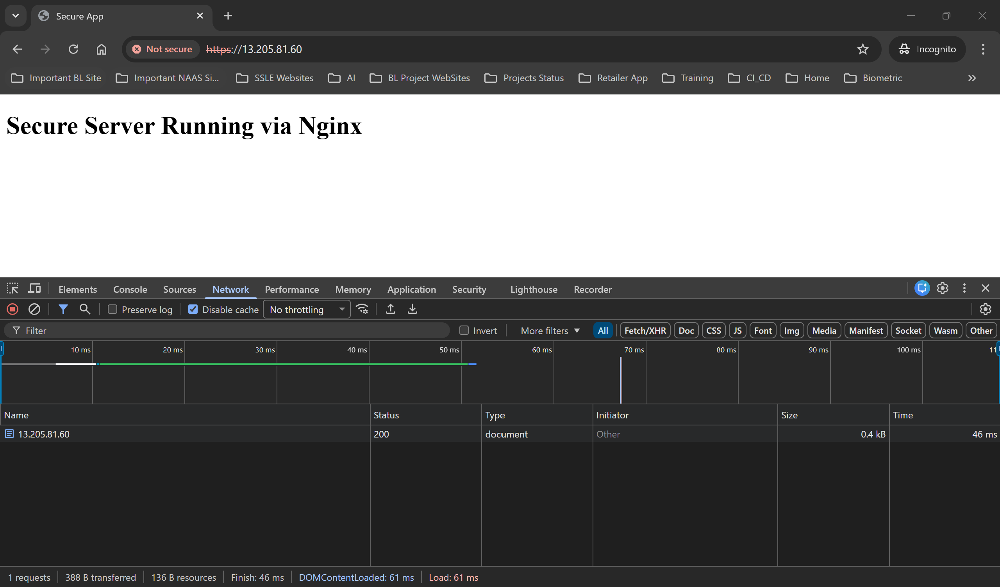
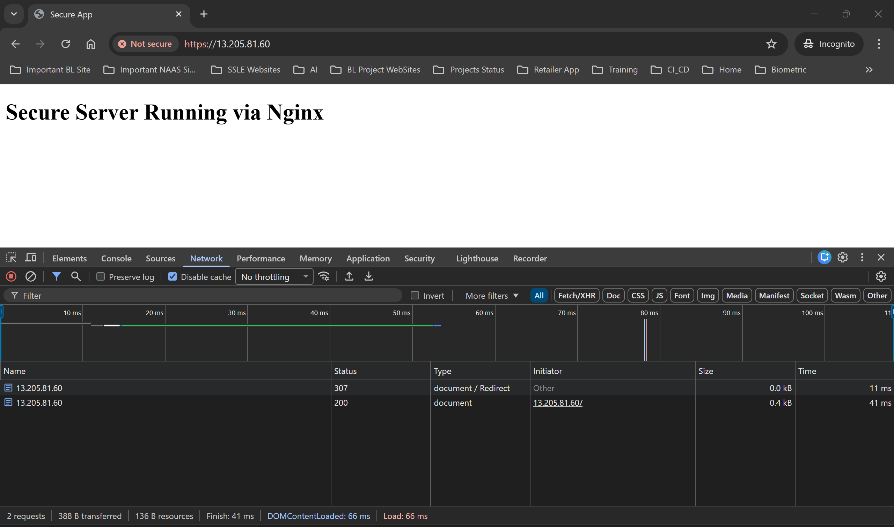
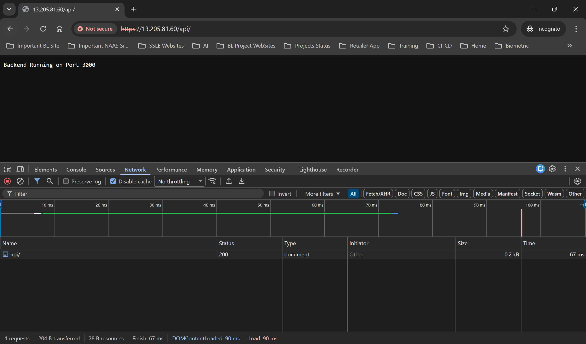

# Nginx HTTPS Reverse Proxy Setup

This project shows how to configure a secure Nginx web server with HTTPS, SSL, and a reverse proxy to a Node.js backend.

---

## Features

- Static website hosting
- Self-signed SSL (OpenSSL)
- HTTP → HTTPS redirect
- Reverse proxy (`/api` → port 3000)
- Backend managed with systemd

---

## Setup

### Install Dependencies

```bash
sudo apt update
sudo apt install nginx openssl nodejs npm vim -y
```

### Enable Nginx

```bash
sudo systemctl enable nginx
sudo systemctl start nginx
```

---

## Static Website

```bash
sudo mkdir -p /var/www/secure-app
sudo vim /var/www/secure-app/index.html
```

---

## SSL Certificate

```bash
sudo mkdir -p /etc/nginx/ssl

sudo openssl req -x509 -nodes -days 365 -newkey rsa:2048 \
-keyout /etc/nginx/ssl/secure-app.key \
-out /etc/nginx/ssl/secure-app.crt
```

Details:
- Country: BD  
- State: Dhaka  
- City: Dhaka  
- Organization: Secure App  
- Common Name: localhost  

---

## Nginx Configuration

```bash
sudo vim /etc/nginx/sites-available/secure-app
sudo ln -s /etc/nginx/sites-available/secure-app /etc/nginx/sites-enabled/
sudo rm /etc/nginx/sites-enabled/default
```

---

## Backend Setup

```bash
sudo mkdir -p /var/www/backend-app
sudo vim /var/www/backend-app/app.js
sudo node /var/www/backend-app/app.js
```

---

## Run as Service

```bash
sudo vim /etc/systemd/system/backend-app.service

sudo systemctl daemon-reexec
sudo systemctl daemon-reload
sudo systemctl start backend-app
sudo systemctl enable backend-app
```

---

## Testing

```bash
sudo nginx -t
sudo systemctl reload nginx
```

### URLs

- http://13.205.81.60/
- https://13.205.81.60/
- https://13.205.81.60/api/  

---


## 📸 Evidence & Screenshots

### https working


### http redirect to https working


### backend service running



## Project Structure

```
module-3-nginx-ssl/
│
├── README.md
├── index.html
├── app.js
├── backend-app.service
├── screenshots/
│   ├── https-working.png
│   ├── redirect-working.png
│   └── backend-running.png
```

---

## Notes

- Self-signed SSL will show browser warning  
- Use Let's Encrypt for production
